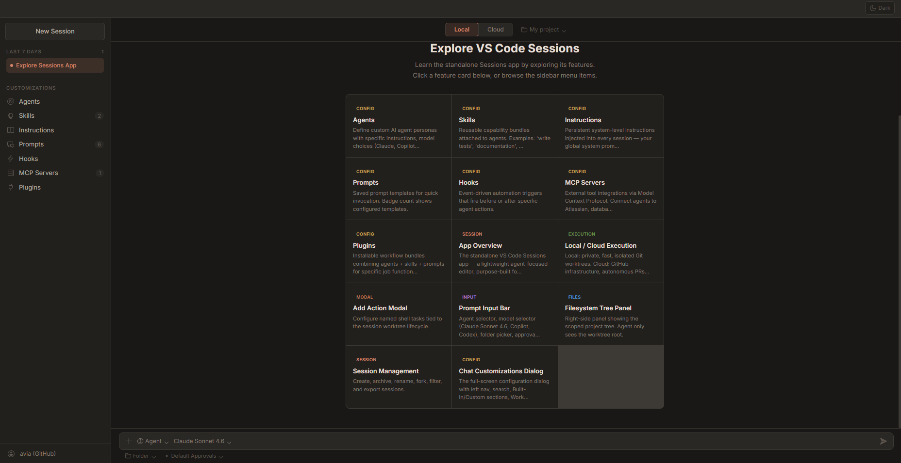

<h3 align="center">Learn VS Code Sessions by exploring it.</h3>

<p align="center">
  <a href="https://chkp-roniz.github.io/learn-sessions/"></a>
  <a href="https://github.com/chkp-roniz/learn-sessions/stargazers"></a>
  
  
</p>

---

An interactive single-page explorer that teaches you everything about **VS Code Sessions** — the standalone experimental app from Microsoft that strips VS Code down to its agentic core.

There is no official documentation, no public download page, and no tutorial. This project fills that gap with a fully interactive simulation you can click through — no access to the app required.

<p align="center">
  
</p>

## What You'll Learn

| Feature              | Description                                                          |
| -------------------- | -------------------------------------------------------------------- |
| 🤖 **Agents**        | Custom AI personas with model choices, instructions, and permissions |
| 💡 **Skills**        | Reusable capability bundles attached to agents                       |
| 📖 **Instructions**  | Persistent system-level prompts injected into every session          |
| 💬 **Prompts**       | Saved prompt templates for quick invocation                          |
| ⚡ **Hooks**         | Event-driven automation before/after agent actions                   |
| 🖥️ **MCP Servers**   | External tool integrations via Model Context Protocol                |
| 🔌 **Plugins**       | Installable workflow bundles combining agents + skills + prompts     |
| 🔀 **Local / Cloud** | Local execution with Git worktrees or cloud via GitHub PRs           |
| 🛡️ **Approvals**     | Default, Bypass, and Autopilot (Preview) permission modes            |
| 📋 **Sessions**      | Create, archive, fork, filter, export, and hand off sessions         |

## Try It

**👉 [chkp-roniz.github.io/learn-sessions](https://chkp-roniz.github.io/learn-sessions/)**

No install, no signup, no build step. Just open it and start clicking.

Or run locally:

```bash
git clone https://github.com/chkp-roniz/learn-sessions.git
open learn-sessions/index.html
```

## Project Structure

```
learn-sessions/
├── index.html          # The entire explorer — single self-contained file
├── README.md
└── .docs/              # Reference screenshots and research notes
    ├── logo.png
    ├── approvals.png
    ├── app.png
    └── ...
```

Zero frameworks, zero bundlers, zero build steps. One HTML file with embedded CSS and vanilla JS.

## Background

VS Code Sessions first surfaced through a [February 2026 GitHub issue](https://github.com/microsoft/vscode-codicons/issues/436) requesting an app icon for _"a standalone experimental app called Sessions — a lightweight version of VS Code focused on agent workflows."_ The issue requested blue, green, and orange icon variants matching VS Code's Stable, Insiders, and Exploration release channels.

This explorer was built from publicly available screenshots and community discussion to help developers understand what Sessions offers before any official docs exist.

## Contributing

Contributions welcome! Areas where help would be great:

- Content updates as new Sessions features ship
- Mobile experience improvements
- Accessibility (keyboard nav, ARIA)

## License

[MIT](LICENSE)
